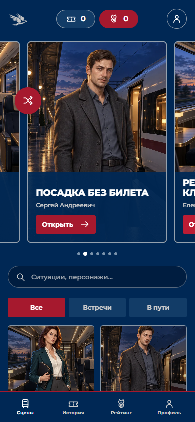

# Белый кречет

Интерактивный тренажёр смены проводника высокоскоростного поезда. Игрок разговаривает с пассажирами свободным текстом или голосом, принимает решения и видит последствия в сцене и разборе смены.

<p align="center">
  
  
</p>

[Скачать APK 0.6.4](https://github.com/sos-mislom/white-gyrfalcon/releases/download/v0.6.4/white-gyrfalcon-0.6.4.apk) · Android 8+

## Уже работает

- 20 сценариев в YAML: посадка, места, дети, доступность, багаж, животные, безопасность и задержки. У каждого есть эскалация, ветки решений и правовое основание.
- Свободный диалог с контекстом сцены и памятью последних ходов. В сценах с несколькими пассажирами можно переключать собеседника и возвращаться к нему.
- Голосовой ввод нескольких предложений с отправкой после двух секунд тишины и озвучка персонажей системным голосом Android.
- Пауза, завершение сцены при выходе, журнал, рейтинг и персональный профиль устройства. Прерванные смены остаются в истории без оценки.
- Раздел «Правила» объединяет нормативные пункты из сценариев и открывает официальные публикации документов.
- Работа игровых правил и журнала после первой загрузки без сети. Генерация новых реплик требует доступного сервера модели.

## Что размещено на стенде

Через [HTTPS-вход для приложения](https://vsm-195-133-66-226.sslip.io/play) доступны мобильный веб-клиент, NestJS API и PostgreSQL с журналами смен. Реплики генерирует подключённая серверная модель GPT OSS 120B; модель **не встроена в APK**. Браузерная версия защищена отдельным входом. Android-приложение открывает стенд без пароля по подписанному пропуску, встроенному в APK. Секрет подписи остаётся только на сервере; пропуск можно отозвать при следующем выпуске.

Android APK — подписанная WebView-оболочка этого клиента с мостом для распознавания речи, синтеза голоса и профиля устройства. Каждая установка получает собственную историю: на Android используется псевдоним, производный от `ANDROID_ID` и пакета приложения; исходный идентификатор не передаётся на сервер. В обычном браузере создаётся отдельный случайный идентификатор. Сервер хранит его хеш и связывает с ним смены. Это профиль устройства, без логина и переноса между разными телефонами. Встроенный пропуск общий для копий одного APK и не служит личным секретом пользователя.

## Структура

| Каталог | Назначение |
| --- | --- |
| `apps/web` | интерфейс новеллы и локальный журнал |
| `apps/api` | API диалога, синхронизации и профилей |
| `apps/android` | Android-оболочка и голосовой мост |
| `packages/simulation-core` | сценарии, последствия и детерминированный расчёт |
| `packages/api-contracts` | общие схемы данных |

[Топология компонентов и BPMN-процессы](architecture/README.md).

[User Flow со скриншотами: ввод реплик, несколько персонажей, безопасность, молчание, оценка и портрет решений](user-flows/README.md).

## Локальный запуск

Нужны Node.js 24.15+ и npm 11+. Установите зависимости командой `npm ci --ignore-scripts`, затем выполните:

```bash
npm run dev
```

Клиент доступен на `http://localhost:3000`, API — на `http://localhost:3100`. Настройки приведены в `.env.example`. Для генерации реплик и распознавания действий задайте `AI_ACTOR_BASE_URL`, `AI_ACTOR_MODEL_NAME` и `AI_ACTOR_API_KEY` через окружение; секреты не записывайте в Git. Игровые правила и явные действия доступны без модели. Проверка проекта: `npm run check`.

Контракт API доступен в Swagger по адресу `http://localhost:3100/docs` и как OpenAPI JSON по `/docs-json`. Помимо игровых методов, API отдаёт конфигурацию (`/config`), рейтинг (`/leaderboard`, `/leaderboard/export.csv`) и учебный отчёт для внешней интеграции (`/integrations/rzd/users/{id}/report`). Изменение конфигурации и отчёты по сотруднику требуют серверного `INTEGRATION_API_KEY_FILE` или `INTEGRATION_API_KEY` длиной от 32 символов. Отчёт содержит учебную рекомендацию к рассмотрению, а не кадровый допуск.

Android-проект собирается Gradle 8.13 и Android SDK 36. Для собственного APK передайте `-PstandUrl=https://<ваш-стенд>`; release-подпись и пропуск читаются только из локальной `.private/android/`. Ключ подписи и готовые APK не хранятся в Git.

## Правовые основания

В сценах используются [Правила перевозок пассажиров, багажа и грузобагажа № 352](https://publication.pravo.gov.ru/Document/View/0001202210270033) и применимые федеральные нормы, например [статья 12 закона № 15-ФЗ](https://publication.pravo.gov.ru/Document/View/0001201302250007) для запрета курения в поезде. Технические учебные допущения не выдаются за инструкцию конкретного перевозчика. Тренажёр не заменяет действующие документы перевозчика и подготовку персонала.

## Изображения и исходники

Скриншоты в `media/` сделаны из рабочего интерфейса. Персонажи и оформление проекта используются как собственные иллюстрации тренажёра. Ключи подписи, учётные данные стенда, серверные настройки и исходные закрытые материалы в репозиторий не входят.
