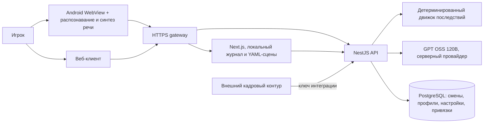

# Архитектура и процессы

Исходные BPMN 2.0 диаграммы открываются в [bpmn.io](https://demo.bpmn.io/):

- [Учебная смена и синхронизация](training-flow.bpmn)
- [Выгрузка учебного результата](rzd-export.bpmn)

## Топология компонентов

Клиент считает действия локально и отправляет журнал в API. Сервер воспроизводит его через тот же движок и хранит подтверждённое состояние. Реплика персонажа приходит потоком, после подтверждения хода клиент озвучивает её системным голосом Android. Профиль привязан к хешу идентификатора установки. Интеграционный API читает только подтверждённые сервером результаты; кадровый допуск остаётся решением работодателя.

В production gateway, web и API работают в отдельных контейнерах. API, web и PostgreSQL доступны друг другу во внутренней IPv6 сети проекта. Наружу опубликован только HTTPS gateway. Модель вызывается сервером через настроенный внешний API; секреты хранятся вне репозитория.
