# User Flow: от реплики до разбора

Кадры сняты с работающего стенда в мобильном окне 393 × 852. Это снимки интерфейса во время реальных игровых ходов, а не макеты. Текст набран в поле проводника; микрофон Android заполняет то же поле, но его работу статичный скриншот не показывает. Ответы и результат повторного прохождения могут отличаться: реплику формирует модель, проверка действия учитывает состояние сцены.

## 1. VIP-сервис: остывший кофе

Пассажир Игорь Валентинович жалуется на холодный кофе. Проводник вводит несколько предложений: признаёт ошибку, обещает сразу забрать напиток, заменить его и предлагает комплимент на время ожидания. После отправки игра выбирает действие из веток [YAML-сцены](../packages/simulation-core/src/scenes/vsm_vip_cold_coffee_01.yaml), применяет последствия и показывает реакцию пассажира. В этом прохождении вопрос решён, итог — **100/100**. В разборе показано основание: приказ Минтранса № 352, п. 7.

| Ввод проводника | Реакция и оценка |
| --- | --- |
| 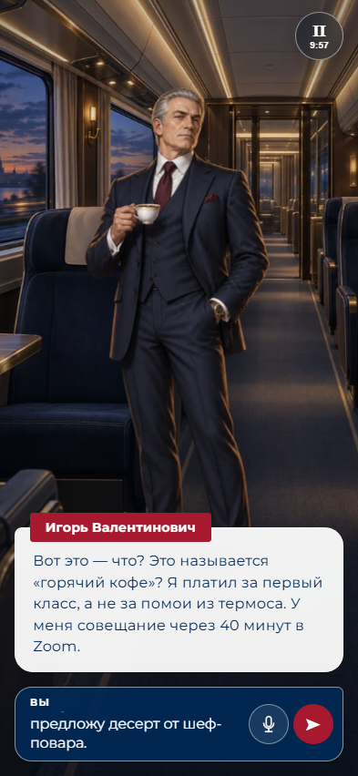 | 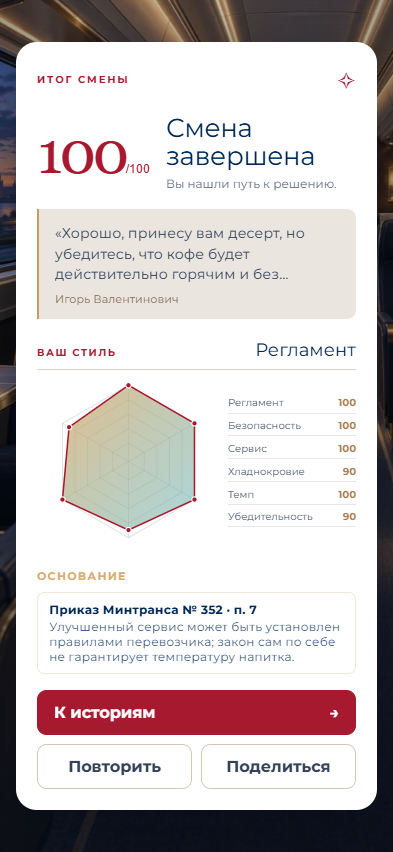 |

Для учебной рекомендации к работе в VIP-вагоне одного результата недостаточно: политика также требует пройти сцену с ребёнком и проверку безопасности, выполнить пороги оценки и получить подтверждённые действия. Это рекомендация к рассмотрению, а не кадровый допуск.

## 2. Несколько персонажей: ребёнок в бизнес-классе

Тамара Павловна просит помочь из-за плача ребёнка. Мария с ребёнком видна дальше по проходу; по ней можно нажать и сменить собеседника. Проводник сначала отвечает Тамаре, затем обращается к Марии. После переключения Тамара остаётся на сцене, и к ней можно вернуться. В показанном прохождении помощь матери решила ситуацию: **100/100**; разбор выводит приказ Минтранса № 352, п. 2.

| Два собеседника | Ввод Тамаре | Ввод Марии |
| --- | --- | --- |
| 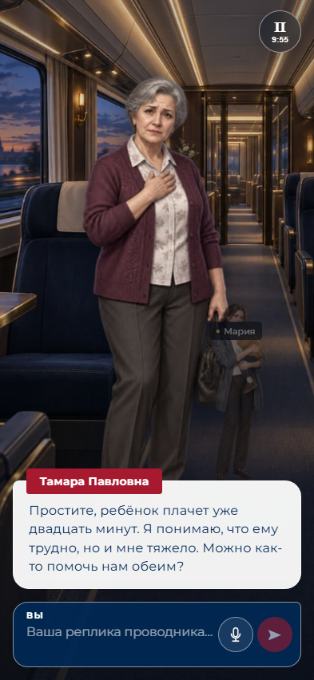 | 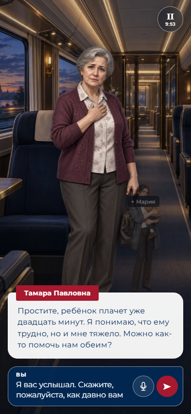 | 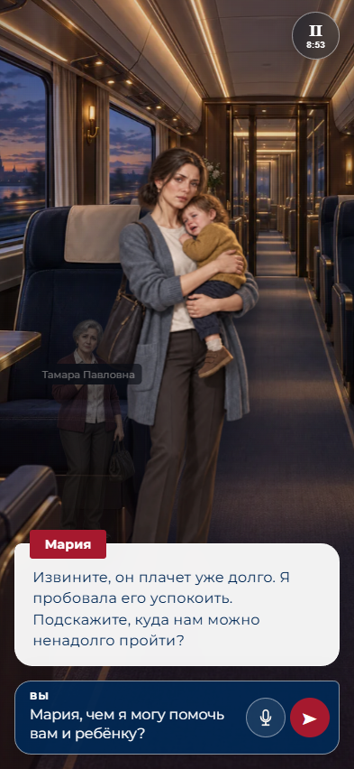 |

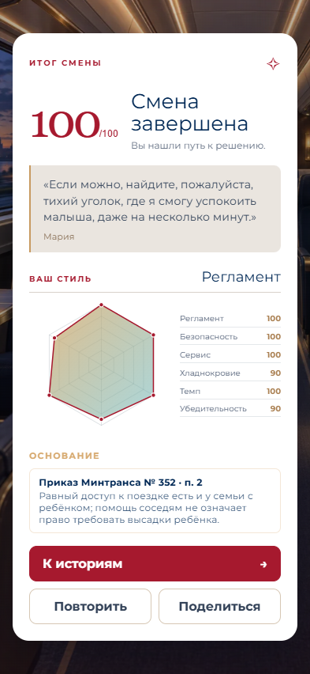

## 3. Безопасность: вейп в туалете

Датчик обнаруживает аэрозоль, пассажир Артём спорит с проводником. Проводник вводит требование прекратить использование вейпа и объясняет запрет. В показанном прохождении пассажир соглашается, сцена завершается на **100/100**. В разборе приведены приказ Минтранса № 352, п. 12 и статья 12, часть 1 закона № 15-ФЗ.

| Ввод проводника | Разбор безопасности |
| --- | --- |
| 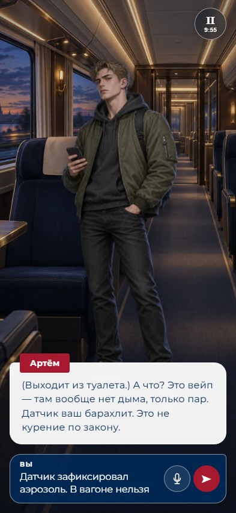 | 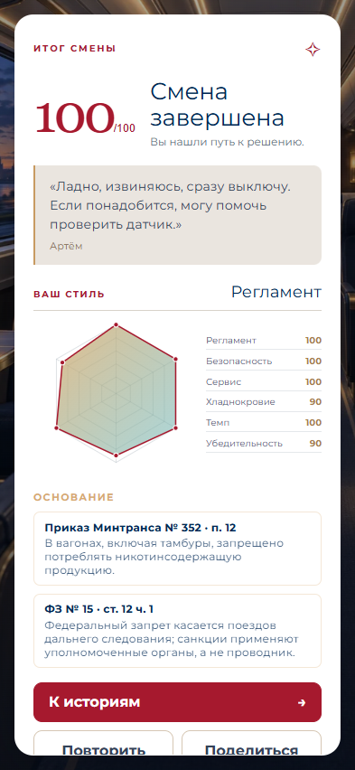 |

## 4. Молчание и грубая речь: эскалация

Проводник открывает VIP-сцену и не отвечает. Игровой таймер запускает ход ожидания: проблема остаётся открытой и получает новый уровень эскалации. Затем проводник вводит грубую реплику; пассажир возражает и требует решить вопрос. При дальнейшем бездействии время на решение истекает. В этом прохождении сцена **не разрешена, 0/100**. Это отдельный неуспешный проход, а не продолжение успешного примера из раздела 1.

| До ответа | После молчания | Грубая реплика |
| --- | --- | --- |
| 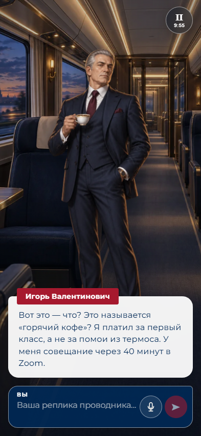 | 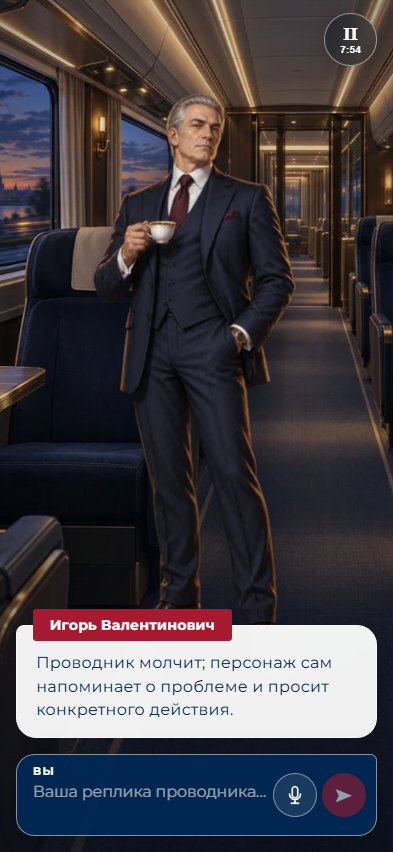 | 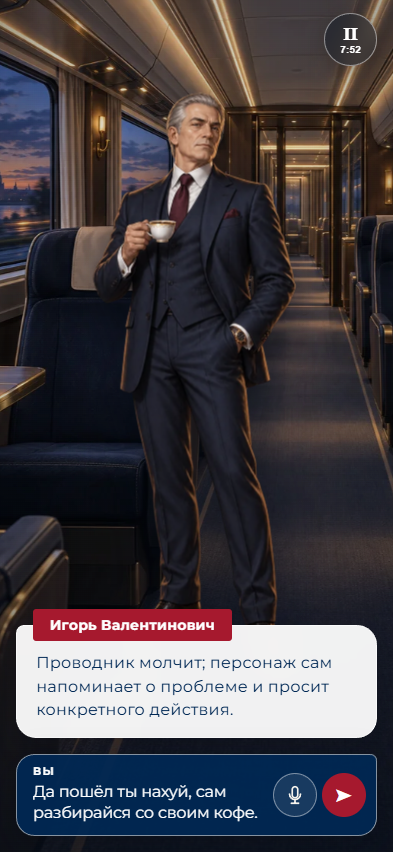 |

| Реакция пассажира | Итог после истечения времени |
| --- | --- |
| 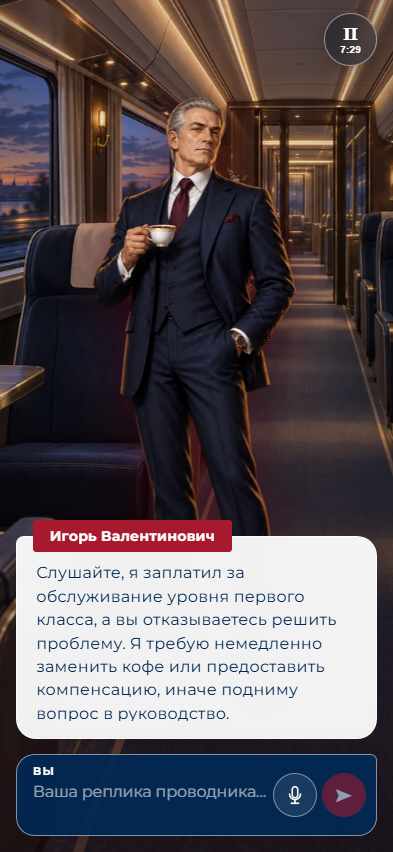 | 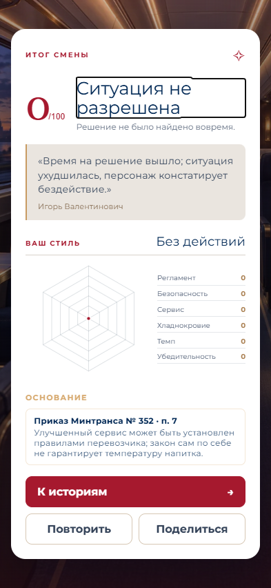 |

В текущей версии текст автоматического напоминания и фраза в неуспешном разборе берутся прямо из описательных векторов YAML. Снимки оставлены без правки; это известное ограничение естественности речи при автоматической эскалации.

## 5. История сцен и общий портрет решений

Вкладка «История» показывает завершённые и прерванные попытки. Прерванная сцена остаётся без оценки. Вкладка «Профиль» усредняет шесть показателей по **всем завершённым сменам**, включая неудачные. На снимке ниже две сцены завершены на 100, одна — на 0; общий профиль показывает 67 баллов по регламенту, безопасности, сервису и темпу, 60 — по хладнокровию и убедительности. Это профиль игровых решений, не медицинская или кадровая психологическая оценка.

| История | Портрет решений |
| --- | --- |
| 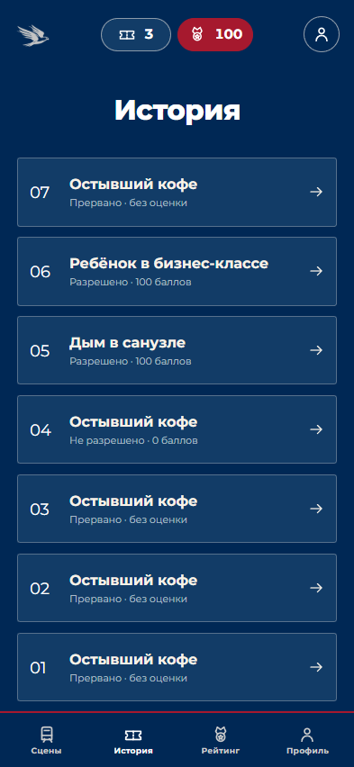 | 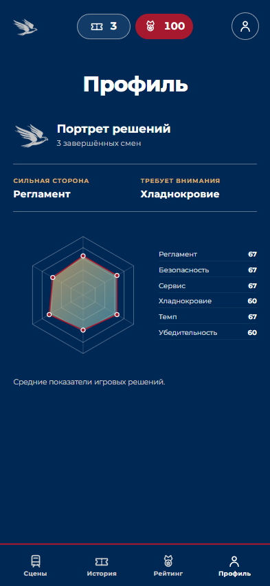 |

Игровой маршрут доступен в [README проекта](../README.md); API и топология описаны в [architecture](../architecture/README.md).
